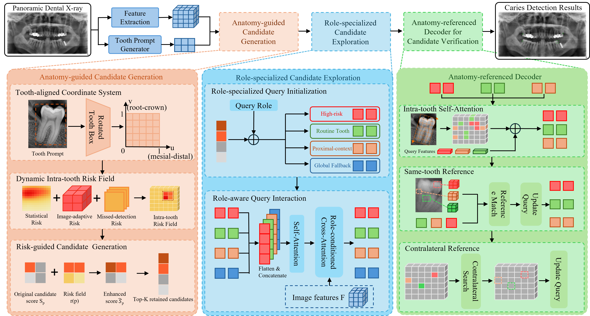

# Anatomy-DETR

Anatomy-DETR is a DETR-based detection framework specifically designed for caries detection in panoramic dental radiographs. It achieves **51.3 mAP on CariesXrays** and **36.7 mAP on DVCT**.

<p align="center">
  
</p>

## 1. Project Structure

```text
.
├── configs/
├── engine/
│   ├── backbone/
│   ├── core/
│   ├── data/
│   ├── deim/
│   ├── misc/
│   ├── optim/
│   └── solver/
├── figure/
│   └── fig_overview.png
├── train.py
├── train.sh
└── requirements.txt
```

Two backbone configurations are provided:

- `configs/train_convnext_s.yml`
- `configs/train_hgnetv2_b5.yml`

## 2. Environment Setup

```bash
conda create -n anatomy-detr python=3.10 -y
conda activate anatomy-detr
conda install pytorch torchvision torchaudio pytorch-cuda=11.8 -c pytorch -c nvidia -y
pip install -r requirements.txt
```

## 3. Dataset Preparation

Organize each dataset as follows:

```text
dataset/
├── 6cls_prompt/
│   ├── 6cls_box_mask_train.json
│   └── 6cls_box_mask_val.json
├── annotations/
│   ├── instances_train.json
│   └── instances_val.json
└── images/
    ├── train/
    └── val/
```

The files under `annotations/` use the standard **COCO object-detection annotation format**. Update the dataset paths in:

```text
configs/dataset/custom_detection.yml
```

### Tooth prompts

Anatomy-DETR relies on an external tooth model to generate tooth-level prompts before training or evaluation. In our experiments, we use **YOLOv9-Seg** to generate these prompts, but other tooth detection or instance-segmentation models can also be used as long as their outputs are converted to the expected JSON format.

The prompt JSON may be either a plain list of prediction records or a COCO-style dictionary containing an `annotations` list. Each tooth prediction should contain:

```json
{
  "image_id": 1,
  "category_id": 0,
  "bbox": [x, y, width, height],
  "segmentation": [[x1, y1, x2, y2, "..."]],
  "score": 0.95
}
```

Field summary:

- `image_id`: ID of the panoramic image; it must match the image ID used by the caries annotation file.
- `category_id`: tooth prompt category. The provided configuration uses six tooth categories and 0-based IDs.
- `bbox`: tooth bounding box in COCO `[x, y, width, height]` format.
- `segmentation`: tooth mask represented using a COCO-compatible polygon or RLE representation.
- `score`: confidence score produced by the external prompt model.

The complete prompt file therefore contains the predicted tooth instances for all images in the corresponding train or validation split. Configure the paths through `tooth_json_file` in `configs/dataset/custom_detection.yml`.

## 4. Pretrained Backbone Weights

Both backbone initializations use pretrained weights obtained from their official model sources.

For ConvNeXtV2, place the downloaded pretrained weight at:

```text
weight/convnext/convnextv2_tiny_384.safetensors
```

For HGNetV2-B5, place the downloaded pretrained weight under:

```text
weight/hgnetv2/
```

The default configuration expects:

```text
weight/hgnetv2/PPHGNetV2_B5_stage1.pth
```

If you store the weights elsewhere, update `local_weight_path` or `local_model_dir` in the corresponding model configuration.

## 5. Training

Example for training ConvNeXtV2 on a single machine with 4 GPUs:

```bash
CUDA_VISIBLE_DEVICES=0,1,2,3 torchrun \
  --master_port=20000 \
  --nproc_per_node=4 \
  train.py \
  -c 'configs/train_convnext_s.yml' \
  --use-amp \
  --seed=0
```

For HGNetV2-B5, replace the configuration with:

```text
configs/train_hgnetv2_b5.yml
```

You can also run the provided training script:

```bash
bash train.sh
```

## 6. Evaluation

Evaluate a trained checkpoint with:

```bash
CUDA_VISIBLE_DEVICES=0,1,2,3 torchrun \
  --master_port=20001 \
  --nproc_per_node=4 \
  train.py \
  -c 'path/to/config.yml' \
  -t 'path/to/trained_checkpoint.pth' \
  --test-only \
  --use-amp \
  --seed=0
```

Make sure that the selected configuration points to the correct validation images, COCO annotations, and validation tooth-prompt JSON.
